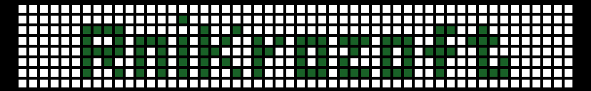

<h1 align="center">👏 Hello there! I'm Jirawat Charoonnet</h1>
<h3 align="center">I am a Programmer, doing Backend/Full-Stack/DevOps Engineering things</h3>

 

 
 

<table>
<tr>
<td>

- 🤹‍♀️&nbsp;Freelance Developer with 3 years of experience
- 💻&nbsp;Designed and developed frontend - backend web application
- 🌟Expertise in Stack `PHP`, `Codeigniter`, `Bootstrap`, `Mysql`, and `WordPress`
- 💪&nbsp;**Strong** experience and success in small to medium-sized project
- 🌍&nbsp;Thailand based
  

</td>
<td>

  

  
</td>
</tr>
</table>

<h2 align="left">Tech</h2>

> Tools, languages, and other things that I work with.

<table style="{border: none;}">
  <tr>
    <td align="center" width="96">
        
       C#.Net
    </td>
    <td align="center" width="96">
        
       Go
    </td>
    <td align="center" width="96">
        
       JavaScript
    </td>
    <td align="center" width="96">
        
       Bootstrap
    </td>
    <td align="center" width="96">
        
       WordPress
    </td>
     <td align="center" width="96">
        
       Jquery
    </td>
     <td align="center" width="96">
        
       PHP
      </td>
    
  <td align="center" width="96"> 
        
       gRPC
    </td>
  <td align="center" width="96"> 
        
       Laravel
    </td>
  
  <td align="center" width="96"> 
        
       MongoDB
    </td>
  </tr>
  <tr>
  <td align="center" width="96"> 
        
       HTML
    </td>
  <td align="center" width="96"> 
        
       Firebase
    </td>
  <td align="center" width="96"> 
        
       Codeigniter
    </td>
    <td align="center" width="96"> 
        
       Docker
    </td>
    <td align="center" width="96">
        
       Kubernetes
    </td>
    <td align="center"  width="96">
        
       MySQL
    </td>
    
  <td align="center" width="96"> 
        
       Postgres
    </td>
  </tr>
</table>

